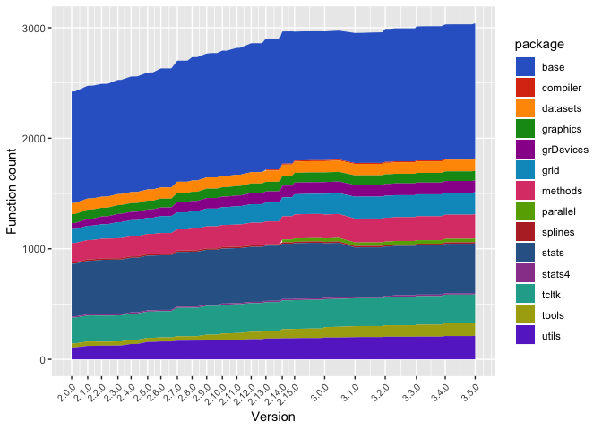

<!-- README.md is generated from README.Rmd. Please edit that file -->
rcheology
=========

A data package which lists every command in base R packages since R version 2.0.0.

Installing
----------

``` r
install.packages("remotes") # if you need to
remotes::install_github("hughjonesd/rcheology")
```

Running it yourself
-------------------

-   Install docker
-   `./control build` builds the images
-   `./control run` runs the images to build/install R and extract data
-   `./control gather` gets CSV files from the containers
-   `./control write` puts CSV files into a data frame and stores it in the package

The data
--------

You can view the data online in a [Shiny app](https://hughjonesd.shinyapps.io/rcheology/).

``` r
library(rcheology)
data("rcheology")

head(rcheology)
#>                name    type    class generic          args package
#> 1                 ! builtin function   FALSE          <NA>    base
#> 2                != builtin function   FALSE          <NA>    base
#> 3                 $ special function   FALSE          <NA>    base
#> 4 $.package_version closure function   FALSE     (x, name)    base
#> 5               $<- special function   FALSE          <NA>    base
#> 6    $<-.data.frame closure function   FALSE (x, i, value)    base
#>   Rversion
#> 1    2.0.0
#> 2    2.0.0
#> 3    2.0.0
#> 4    2.0.0
#> 5    2.0.0
#> 6    2.0.0
```

Base functions over time:

``` r
library(ggplot2)
library(dplyr)
#> 
#> Attaching package: 'dplyr'
#> The following objects are masked from 'package:stats':
#> 
#>     filter, lag
#> The following objects are masked from 'package:base':
#> 
#>     intersect, setdiff, setequal, union

rvs <- rcheology$Rversion     %>% 
      unique()                %>% 
      as.package_version()    %>% 
      sort() %>% 
      as.character()

major_rvs <- grep(".0$", rvs, value = TRUE)
      
ggplot(rcheology, aes(Rversion, group = package, fill= package), colour = NA) + 
      stat_count(geom = "area") + 
      theme(axis.text.x = element_text(angle = 45, hjust = 1, size = 8)) + 
      ggthemes::scale_fill_gdocs() +
      scale_x_discrete(limits  = rvs, breaks = major_rvs)
```


