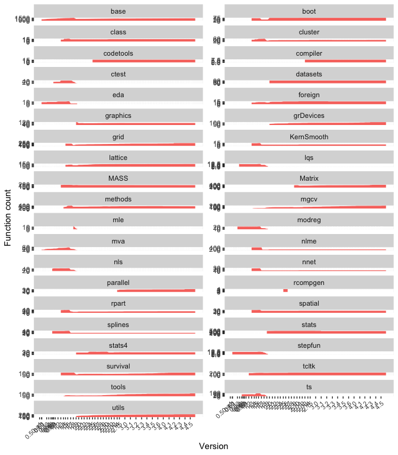

<!-- README.md is generated from README.Rmd. Please edit that file -->

# rcheology

[](https://ci.appveyor.com/project/hughjonesd/rcheology)
 [](https://cran.r-project.org/package=rcheology)
[](https://cran.r-project.org/package=rcheology)

A data package which lists every command in base R packages since R
version 0.62.3.

The latest R version covered is 4.3.1.

You can view the data online in a [Shiny
app](https://hughjonesd.shinyapps.io/rcheology/).

## Installing

From [r-universe](https://r-universe.dev):

``` r
install.packages('rcheology', repos = c('https://hughjonesd.r-universe.dev', 
                    'https://cloud.r-project.org'))
```

From CRAN:

``` r
install.packages('rcheology')
```

<!-- this is .Rmd so it can be easily included by README.Rmd -->

## Where the data comes from

R versions are built using the
[evercran](https://github.com/r-hub/evercran) project.

Results are found from running `ls(all.names = TRUE)` on all installed
packages. For more details, see `guest-list-objects.R`.

The `Rversions` data frame lists versions of R and release dates.

## Do it yourself

- Install and start docker.
- Run `host-run-on-evercran.sh`.

## The data

``` r
library(rcheology)
data("rcheology")

rcheology[rcheology$name == "kmeans" & rcheology$Rversion %in% c("1.0.1", "1.9.0", "2.1.0", "3.0.2", "3.2.0", "4.0.2"), ]
#>        package   name Rversion    type exported    class generic
#> 322049     mva kmeans    1.0.1 closure     TRUE     <NA>   FALSE
#> 370732   stats kmeans    1.9.0 closure     TRUE function   FALSE
#> 370736   stats kmeans    2.1.0 closure     TRUE function   FALSE
#> 370776   stats kmeans    3.0.2 closure     TRUE function   FALSE
#> 370782   stats kmeans    3.2.0 closure     TRUE function   FALSE
#> 370807   stats kmeans    4.0.2 closure     TRUE function   FALSE
#>                                                                                                                              args
#> 322049                                                                                                (x, centers, iter.max = 10)
#> 370732                                                                                                (x, centers, iter.max = 10)
#> 370736                  (x, centers, iter.max = 10, nstart = 1, algorithm = c("Hartigan-Wong",     "Lloyd", "Forgy", "MacQueen"))
#> 370776   (x, centers, iter.max = 10, nstart = 1, algorithm = c("Hartigan-Wong",     "Lloyd", "Forgy", "MacQueen"), trace = FALSE)
#> 370782 (x, centers, iter.max = 10L, nstart = 1L, algorithm = c("Hartigan-Wong",     "Lloyd", "Forgy", "MacQueen"), trace = FALSE)
#> 370807 (x, centers, iter.max = 10L, nstart = 1L, algorithm = c("Hartigan-Wong",     "Lloyd", "Forgy", "MacQueen"), trace = FALSE)
```

Latest changes:

``` r

suppressPackageStartupMessages(library(dplyr))

r_penultimate <- sort(package_version(unique(rcheology::rcheology$Rversion)), 
      decreasing = TRUE)
r_penultimate <- r_penultimate[2]

r_latest_obj <- rcheology %>% dplyr::filter(Rversion == r_latest)
r_penult_obj <- rcheology %>% dplyr::filter(Rversion == r_penultimate)

r_introduced <- anti_join(r_latest_obj, r_penult_obj, by = c("package", "name"))

r_introduced
#> # A tibble: 0 × 8
#> # ℹ 8 variables: package <chr>, name <chr>, Rversion <chr>, type <chr>,
#> #   exported <lgl>, class <chr>, generic <lgl>, args <chr>
```

Base functions over time:

``` r
library(ggplot2)
#> Warning: package 'ggplot2' was built under R version 4.3.1

rvs <- rcheology$Rversion     %>% 
      unique()                %>% 
      as.package_version()    %>% 
      sort() %>% 
      as.character()

major_rvs <- grep(".0$", rvs, value = TRUE)
major_rv_dates <- Rversions$date[Rversions$Rversion %in% major_rvs]
major_rvs <- gsub("\\.0$", "", major_rvs)

rch_dates <- rcheology %>% left_join(Rversions, by = "Rversion")
ggplot(rch_dates, aes(date, group = package, fill = package), colour = NA) + 
      stat_count(geom = "area") + 
      theme(axis.text.x = element_text(angle = 45, hjust = 1, size = 8)) + 
      # ggthemes::scale_fill_gdocs() +
      scale_x_date(breaks  = major_rv_dates, labels = major_rvs) + 
      xlab("Version") + ylab("Function count") + 
      theme(legend.position = "top")
```


An alternative view:

``` r


ggplot(rch_dates, aes(date, fill = "orange")) + 
      stat_count(geom = "area") + 
      scale_x_date(breaks  = major_rv_dates, labels = major_rvs) + 
      theme(axis.text.x = element_text(angle = 45, hjust = 1, size = 8)) + 
      xlab("Version") + ylab("Function count") + 
      facet_wrap(~package, scales = "free_y", ncol = 2) +
      theme(legend.position = "none") 
```


