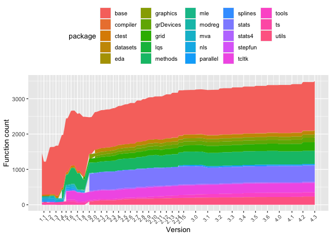

<!-- README.md is generated from README.Rmd. Please edit that file -->

# rcheology

[](https://travis-ci.org/hughjonesd/rcheology)
[](https://ci.appveyor.com/project/hughjonesd/rcheology)
[](https://cran.r-project.org/package=rcheology)
[](https://cran.r-project.org/package=rcheology)

A data package which lists every command in base R packages since R
version 1.0.1.

The latest R version covered is 4.0.3.

You can view the data online in a [Shiny
app](https://hughjonesd.shinyapps.io/rcheology/).

## Installing

From CRAN:

``` r
install.packages('rcheology')
```

<!-- this is .Rmd so it can be easily included by README.Rmd -->

## Where the data comes from

Versions 4.0.0 and up are installed from the [CRAN apt repositories for
Ubuntu
Bionic](https://cran.r-project.org/bin/linux/ubuntu/bionic-cran40/).

Versions 3.0.1 to 3.6.3 are installed from the [CRAN apt repositories
for Ubuntu Trusty
Tahr](https://cran.r-project.org/bin/linux/ubuntu/trusty/). Version
3.5.0 and up use a [special
repository](https://cran.r-project.org/bin/linux/ubuntu/trusty-cran35/).

Versions 2.5.1 to 3.0.0 are built from source on [Ubuntu Lucid
Lynx](https://hub.docker.com/r/yamamuteki/ubuntu-lucid-i386/).

Versions 1.2.3 to 2.4.1 are mostly built from source on [Debian
Sarge](https://hub.docker.com/r/debian/eol/).

Versions 1.0.1 to 1.2.2 (and a couple of later versions) are built from
source on [Debian Woody](https://hub.docker.com/r/debian/eol/).

Results are found from running `ls` on all installed packages from a
minimal installation. Recommended packages are not included.

The `Rversions` data frame lists versions of R and release dates.

## Do it yourself

  - Install docker.
  - `./control build` builds the images. Or get them from
    <https://hub.docker.com/r/dash2/rcheology/>.
  - `./control run` runs the images to build/install R and extract data
  - `./control gather` gets CSV files from the containers
  - `./control write` puts CSV files into a data frame and stores it in
    the package

## The data

``` r
library(rcheology)
data("rcheology")

rcheology[rcheology$name == "kmeans" & rcheology$Rversion %in% c("1.0.1", "1.9.0", "2.1.0", "3.0.2", "3.2.0", "4.0.2"), ]
#>        package   name Rversion    type exported    class generic
#> 189154     mva kmeans    1.0.1 closure     TRUE     <NA>   FALSE
#> 207263   stats kmeans    1.9.0 closure     TRUE function   FALSE
#> 207267   stats kmeans    2.1.0 closure     TRUE function   FALSE
#> 207306   stats kmeans    3.0.2 closure     TRUE function   FALSE
#> 207311   stats kmeans    3.2.0 closure     TRUE function   FALSE
#> 207336   stats kmeans    4.0.2 closure     TRUE function   FALSE
#>                                                                                                                              args
#> 189154                                                                                                (x, centers, iter.max = 10)
#> 207263                                                                                                (x, centers, iter.max = 10)
#> 207267                  (x, centers, iter.max = 10, nstart = 1, algorithm = c("Hartigan-Wong",     "Lloyd", "Forgy", "MacQueen"))
#> 207306   (x, centers, iter.max = 10, nstart = 1, algorithm = c("Hartigan-Wong",     "Lloyd", "Forgy", "MacQueen"), trace = FALSE)
#> 207311 (x, centers, iter.max = 10L, nstart = 1L, algorithm = c("Hartigan-Wong",     "Lloyd", "Forgy", "MacQueen"), trace = FALSE)
#> 207336 (x, centers, iter.max = 10L, nstart = 1L, algorithm = c("Hartigan-Wong",     "Lloyd", "Forgy", "MacQueen"), trace = FALSE)
```

Latest changes:

``` r

suppressPackageStartupMessages(library(dplyr))

r_penultimate <- sort(package_version(unique(rcheology::rcheology$Rversion)), 
      decreasing = TRUE)
r_penultimate <- r_penultimate[2]

r_latest_obj <- rcheology %>% filter(Rversion == r_latest)
r_penult_obj <- rcheology %>% filter(Rversion == r_penultimate)

r_introduced <- anti_join(r_latest_obj, r_penult_obj, by = c("package", "name"))

r_introduced
#> [1] package  name     Rversion type     exported class    generic  args    
#> <0 rows> (or 0-length row.names)
```

Base functions over time:

``` r
library(ggplot2)

rvs <- rcheology$Rversion     %>% 
      unique()                %>% 
      as.package_version()    %>% 
      sort() %>% 
      as.character()

major_rvs <- grep(".0$", rvs, value = TRUE)
major_rv_dates <- Rversions$date[Rversions$Rversion %in% major_rvs]
major_rvs <- gsub("\\.0$", "", major_rvs)

rch_dates <- rcheology %>% left_join(Rversions, by = "Rversion")
ggplot(rch_dates, aes(date, group = package, fill = package), colour = NA) + 
      stat_count(geom = "area") + 
      theme(axis.text.x = element_text(angle = 45, hjust = 1, size = 8)) + 
      # ggthemes::scale_fill_gdocs() +
      scale_x_date(breaks  = major_rv_dates, labels = major_rvs) + 
      xlab("Version") + ylab("Function count") + 
      theme(legend.position = "top")
```



An alternative view:

``` r


ggplot(rch_dates, aes(date, fill = "orange")) + 
      stat_count(geom = "area") + 
      scale_x_date(breaks  = major_rv_dates, labels = major_rvs) + 
      theme(axis.text.x = element_text(angle = 45, hjust = 1, size = 8)) + 
      xlab("Version") + ylab("Function count") + 
      facet_wrap(~package, scales = "free_y", ncol = 2) +
      theme(legend.position = "none") 
```


