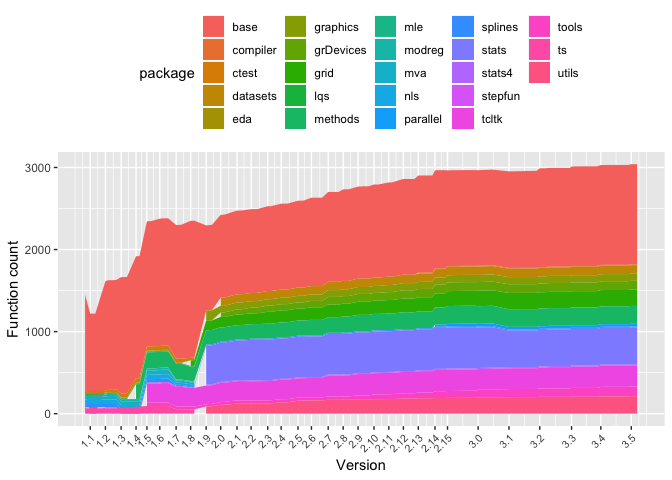

<!-- README.md is generated from README.Rmd. Please edit that file -->
rcheology
=========

[](https://travis-ci.org/hughjonesd/rcheology) [](https://ci.appveyor.com/project/hughjonesd/rcheology) [](https://cran.r-project.org/package=rcheology)

A data package which lists every command in base R packages since R version 2.0.0.

The latest R version covered is 3.5.1.

Installing
----------

``` r
install.packages("remotes") # if you need to
remotes::install_github("hughjonesd/rcheology")
```

Where the data comes from
-------------------------

Versions 3.0.1 and up are installed from the [CRAN apt repositories for Ubuntu Trusty Tahr](https://cran.r-project.org/bin/linux/ubuntu/trusty/). Version 3.5.0 and up use a [special repository](https://cran.r-project.org/bin/linux/ubuntu/trusty-cran35/).

Versions 2.5.1 to 3.0.0 are built from source on [Ubuntu Lucid Lynx](https://hub.docker.com/r/yamamuteki/ubuntu-lucid-i386/).

Versions 2.0.0 to 2.4.1 are built from source on [Debian Sarge](https://hub.docker.com/r/debian/eol/).

Results are found from running `ls` on all installed packages from a minimal installation. Recommended packages are not included.

The `Rversions` data frame lists versions of R and release dates.

Do it yourself
--------------

-   Install docker
-   `./control build` builds the images. Or get them from <https://hub.docker.com/r/dash2/rcheology/>.
-   `./control run` runs the images to build/install R and extract data
-   `./control gather` gets CSV files from the containers
-   `./control write` puts CSV files into a data frame and stores it in the package

The data
--------

You can view the data online in a [Shiny app](https://hughjonesd.shinyapps.io/rcheology/).

``` r
library(rcheology)
data("rcheology")

head(rcheology)
#>                name    type    class generic          args package
#> 1                 ! builtin function   FALSE          <NA>    base
#> 2                != builtin function   FALSE          <NA>    base
#> 3                 $ special function   FALSE          <NA>    base
#> 4 $.package_version closure function   FALSE     (x, name)    base
#> 5               $<- special function   FALSE          <NA>    base
#> 6    $<-.data.frame closure function   FALSE (x, i, value)    base
#>   Rversion
#> 1    2.0.0
#> 2    2.0.0
#> 3    2.0.0
#> 4    2.0.0
#> 5    2.0.0
#> 6    2.0.0
```

Base functions over time:

``` r
library(ggplot2)
suppressPackageStartupMessages(library(dplyr))
#> Warning: package 'dplyr' was built under R version 3.5.1

rvs <- rcheology$Rversion     %>% 
      unique()                %>% 
      as.package_version()    %>% 
      sort() %>% 
      as.character()

major_rvs <- grep(".0$", rvs, value = TRUE)
major_rv_dates <- Rversions$date[Rversions$Rversion %in% major_rvs]

rch_dates <- rcheology %>% left_join(Rversions, by = "Rversion")
ggplot(rch_dates, aes(date, group = package, fill= package), colour = NA) + 
      stat_count(geom = "area") + 
      theme(axis.text.x = element_text(angle = 45, hjust = 1, size = 8)) + 
      ggthemes::scale_fill_gdocs() +
      scale_x_date(breaks  = major_rv_dates, labels = major_rvs) + 
      xlab("Version") + ylab("Function count")
```


