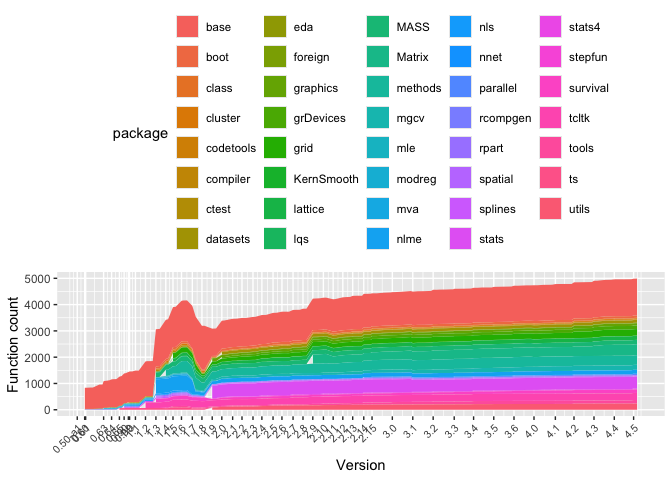

<!-- README.md is generated from README.Rmd. Please edit that file -->

# rcheology

[](https://ci.appveyor.com/project/hughjonesd/rcheology)
 [](https://cran.r-project.org/package=rcheology)
[](https://cran.r-project.org/package=rcheology)

A data package which lists every command in base R packages since R
version 0.50.

The latest R version covered is 4.4.3.

You can view the data online in a [Shiny
app](https://hughjonesd.shinyapps.io/rcheology/).

## Installing

From [r-universe](https://r-universe.dev):

``` r
install.packages('rcheology', repos = c('https://hughjonesd.r-universe.dev', 
                    'https://cloud.r-project.org'))
```

From CRAN:

``` r
install.packages('rcheology')
```

<!-- this is .Rmd so it can be easily included by README.Rmd -->

## Where the data comes from

R versions are built using the
[evercran](https://github.com/r-hub/evercran) project.

Results are found from running `ls(all.names = TRUE)` on all installed
packages. For more details, see `guest-list-objects.R`.

The `Rversions` data frame lists versions of R and release dates.

## Do it yourself

- Install and start docker.
- Run `host-run-on-evercran.sh`.

## The data

``` r
library(rcheology)
data("rcheology")

rcheology[rcheology$name == "kmeans" & rcheology$Rversion %in% c("1.0.1", "1.9.0", "2.1.0", "3.0.2", "3.2.0", "4.0.2"), ]
#>        package   name Rversion priority    type exported hidden    class
#> 348480     mva kmeans    1.0.1     <NA> closure     TRUE  FALSE     <NA>
#> 399952   stats kmeans    1.9.0     base closure     TRUE  FALSE function
#> 399956   stats kmeans    2.1.0     base closure     TRUE  FALSE function
#> 399996   stats kmeans    3.0.2     base closure     TRUE  FALSE function
#> 400002   stats kmeans    3.2.0     base closure     TRUE  FALSE function
#> 400027   stats kmeans    4.0.2     base closure     TRUE  FALSE function
#>        S4generic
#> 348480     FALSE
#> 399952     FALSE
#> 399956     FALSE
#> 399996     FALSE
#> 400002     FALSE
#> 400027     FALSE
#>                                                                                                                              args
#> 348480                                                                                                (x, centers, iter.max = 10)
#> 399952                                                                                                (x, centers, iter.max = 10)
#> 399956                  (x, centers, iter.max = 10, nstart = 1, algorithm = c("Hartigan-Wong",     "Lloyd", "Forgy", "MacQueen"))
#> 399996   (x, centers, iter.max = 10, nstart = 1, algorithm = c("Hartigan-Wong",     "Lloyd", "Forgy", "MacQueen"), trace = FALSE)
#> 400002 (x, centers, iter.max = 10L, nstart = 1L, algorithm = c("Hartigan-Wong",     "Lloyd", "Forgy", "MacQueen"), trace = FALSE)
#> 400027 (x, centers, iter.max = 10L, nstart = 1L, algorithm = c("Hartigan-Wong",     "Lloyd", "Forgy", "MacQueen"), trace = FALSE)
```

Latest changes:

``` r

suppressPackageStartupMessages(library(dplyr))

r_penultimate <- sort(package_version(unique(rcheology::rcheology$Rversion)), 
      decreasing = TRUE)
r_penultimate <- r_penultimate[2]

r_latest_obj <- rcheology %>% dplyr::filter(Rversion == r_latest)
r_penult_obj <- rcheology %>% dplyr::filter(Rversion == r_penultimate)

r_introduced <- anti_join(r_latest_obj, r_penult_obj, by = c("package", "name"))

r_introduced
#> # A tibble: 3 × 10
#>   package  name    Rversion priority type  exported hidden class S4generic args 
#>   <chr>    <chr>   <chr>    <chr>    <chr> <lgl>    <lgl>  <chr> <lgl>     <chr>
#> 1 survival braking 4.4.3    recomme… list  FALSE    FALSE  tmer… FALSE      <NA>
#> 2 survival fromti… 4.4.3    recomme… clos… TRUE     FALSE  func… FALSE     "(fo…
#> 3 survival totime… 4.4.3    recomme… clos… TRUE     FALSE  func… FALSE     "(fo…
```

Base functions over time:

``` r
library(ggplot2)

rvs <- rcheology$Rversion     %>% 
      unique()                %>% 
      as.package_version()    %>% 
      sort() %>% 
      as.character()

major_rvs <- grep(".0$", rvs, value = TRUE)
major_rvs <- gsub("0.50", "0.50-a1", major_rvs)
major_rvs <- gsub("0.60", "0.60.0", major_rvs)
major_rv_dates <- Rversions$date[Rversions$Rversion %in% major_rvs]
major_rv_dates
#>  [1] "1997-07-22" "1997-12-04" "1997-12-22" "1998-11-14" "1999-04-08"
#>  [6] "1999-08-28" "1999-11-22" "2000-02-07" "2000-02-29" "2000-06-15"
#> [11] "2000-12-15" "2001-06-22" "2001-12-19" "2002-04-29" "2002-10-01"
#> [16] "2003-04-16" "2003-10-08" "2004-04-12" "2004-10-04" "2005-04-19"
#> [21] "2005-10-06" "2006-04-24" "2006-10-03" "2007-04-24" "2007-10-03"
#> [26] "2008-04-22" "2008-10-20" "2009-04-17" "2009-10-26" "2010-04-22"
#> [31] "2010-10-15" "2011-04-13" "2011-10-31" "2012-03-30" "2013-04-03"
#> [36] "2014-04-10" "2015-04-16" "2016-05-03" "2017-04-21" "2018-04-23"
#> [41] "2019-04-26" "2020-04-24" "2021-05-18" "2022-04-22" "2023-04-21"
#> [46] "2024-04-24"
major_rvs <- gsub("\\.0$", "", major_rvs)

rch_dates <- rcheology %>% left_join(Rversions, by = "Rversion")
ggplot(rch_dates, aes(date, group = package, fill = package), colour = NA) + 
      stat_count(geom = "area") + 
      theme(axis.text.x = element_text(angle = 45, hjust = 1, size = 8)) + 
      # ggthemes::scale_fill_gdocs() +
      scale_x_date(breaks  = major_rv_dates, labels = major_rvs) + 
      xlab("Version") + ylab("Function count") + 
      theme(legend.position = "top")
#> Warning: Removed 1615 rows containing non-finite outside the scale range
#> (`stat_count()`).
```



An alternative view:

``` r


ggplot(rch_dates, aes(date, fill = "orange")) + 
      stat_count(geom = "area") + 
      scale_x_date(breaks  = major_rv_dates, labels = major_rvs) + 
      theme(axis.text.x = element_text(angle = 45, hjust = 1, size = 8)) + 
      xlab("Version") + ylab("Function count") + 
      facet_wrap(~package, scales = "free_y", ncol = 2) +
      theme(legend.position = "none") 
#> Warning: Removed 1615 rows containing non-finite outside the scale range
#> (`stat_count()`).
```


